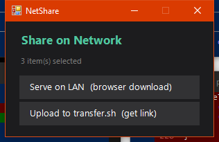
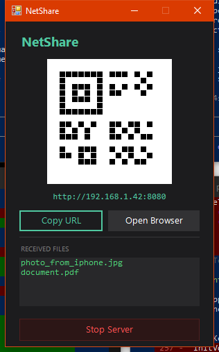
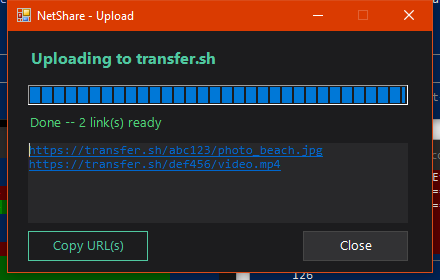

# NetShare Menu

Right-click any file, folder, or the desktop to instantly share or receive files over your local network — no cloud, no accounts, no cables. Works with every device that has a browser: iPhone, Android, Mac, Linux. Runs on **Windows, macOS, and Linux**.

## Screenshots

Pick how to share:



Scan the QR from any device on the same network. Files received appear in the list as they arrive:



Or upload to transfer.sh for an internet-accessible link:



## What it does

### Send With NetShare (right-click any file or folder)
Choose between two modes:
- **Serve on LAN** — starts a local HTTP server and shows a QR code + URL. Anyone on the same Wi-Fi scans or types the URL to download. The browser page also has a drag-and-drop upload zone so they can send files back to you at the same time. Received files land in `Downloads\received\`.
- **Upload to transfer.sh** — uploads to [transfer.sh](https://transfer.sh) and copies the shareable download link to your clipboard. Multiple files are zipped automatically. Links expire in 14 days.

### Receive a File (right-click desktop or folder background)
Opens a receive-only server so other devices can send files to you without you needing to share anything first. Files land in `Downloads\received\`.

## Security

NetShare is built for low-friction sharing with people next to you (studio clients, friends on the same Wi-Fi). It pairs zero-effort access for invited guests with a hard fence against everyone else:

- **QR-gated access (since v1.1.0).** Each session generates a fresh 144-bit URL-safe token baked into the QR code. The first request with a valid `?t=<token>` sets a `nst` session cookie; every subsequent click and upload rides on that cookie — guests don't need to retype anything. Anyone without the token (and without the cookie) gets a flat 403. Constant-time comparison prevents timing leaks.
- **LAN-only bind (since v1.1.0).** The HTTP server binds only to your LAN IP, not `0.0.0.0`. VPN tunnels, guest Wi-Fi adapters, and other interfaces are not exposed.
- **Per-session token.** Tokens live only as long as the server window is open. Close the window → token is gone, even the same QR code stops working.

This is light authentication, not bank-grade — there's still no TLS (LAN HTTP), and anyone on the same Wi-Fi who can sniff the QR's URL can join the session. Treat the QR like a room key, not a password.

## Install

### Windows

Right-click `install.ps1` → **Run with PowerShell**, or:

```powershell
git clone https://github.com/toyuvalo/netshare-menu
cd netshare-menu
powershell -ExecutionPolicy Bypass -File install.ps1
```

The installer:
- Registers **Send With NetShare** on right-click for all files and folders (HKCU — no admin needed)
- Registers **Receive a File** on right-click for the desktop and folder backgrounds
- Adds a Windows Firewall inbound rule for ports 8080–8099 (UAC prompt — click Yes)
- Auto-installs the `qrcode` Python package for QR code generation

### macOS

```bash
git clone https://github.com/toyuvalo/netshare-menu
cd netshare-menu
bash install-mac.sh
```

The installer:
- Installs `qrcode[pil]` for QR code display
- Registers **Share with NetShare** as a Finder Quick Action (right-click any file or folder)
- Registers **Receive Files (NetShare)** as a Finder service (Finder menu bar → Services)

### Linux

```bash
git clone https://github.com/toyuvalo/netshare-menu
cd netshare-menu
bash install-linux.sh
```

The installer:
- Installs `qrcode[pil]` for QR code display
- Registers **Share with NetShare** and **Receive Files (NetShare)** in GNOME/Nautilus (Scripts menu) and KDE/Dolphin (service menu) — Plasma 5 + 6

## Requirements

| OS | Requirements |
|----|-------------|
| Windows | Windows 10/11, Python 3.8+, `curl.exe` (built-in since Win 10 1803) |
| macOS | Python 3.8+, macOS 10.15+ |
| Linux | Python 3.8+, GNOME/Nautilus or KDE/Dolphin |

## How it works

| Mode | How |
|------|-----|
| Serve on LAN | Python `http.server` on ports 8080–8099, served from the selected file's folder |
| Receive | Same server, pointed at `Downloads\received\`, upload-only browser UI |
| Upload | `curl.exe` upload to `transfer.sh`, result URL shown and copied to clipboard |

The server page is a dark-themed single-page HTML app served by `server.py` — no dependencies, works in any browser on any device.

## Uninstall

| OS | Command |
|----|---------|
| Windows | Right-click `uninstall.ps1` → Run with PowerShell, or: `powershell -ExecutionPolicy Bypass -File "%LOCALAPPDATA%\NetShareMenu\uninstall.ps1"` |
| macOS | `bash uninstall-mac.sh` |
| Linux | `bash uninstall-linux.sh` |

## Related

- [doc-convert-menu](https://github.com/toyuvalo/doc-convert-menu) — right-click image/PDF/document conversion
- [ffmpeg-context-menu](https://github.com/toyuvalo/ffmpeg-context-menu) — right-click audio/video conversion

## License

MIT with [Commons Clause](https://commonsclause.com/) — free to use, modify, and share. Commercial resale not permitted.
